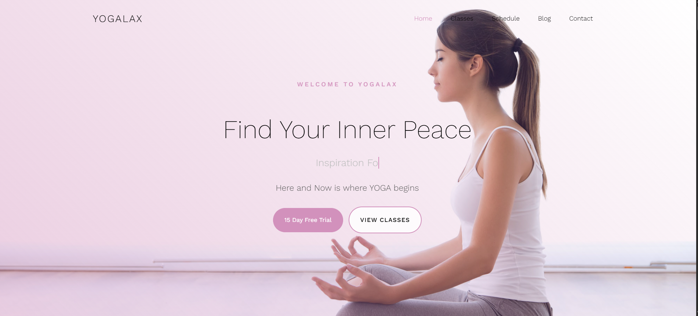
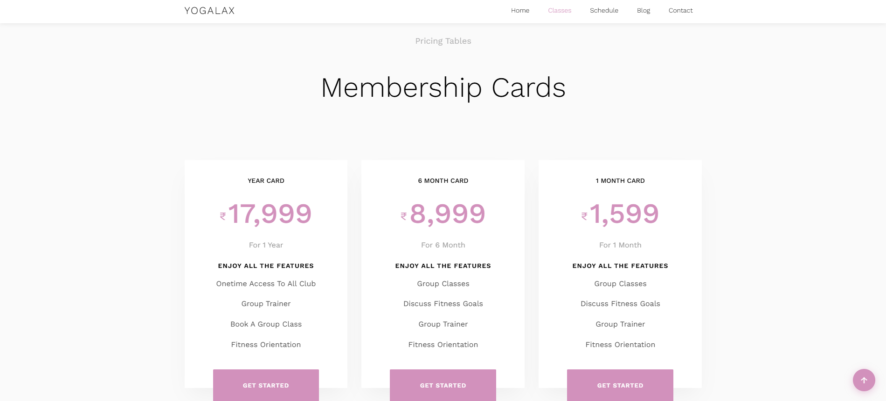
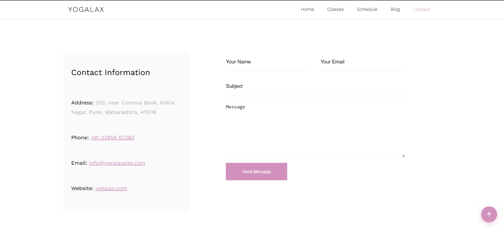

# Yogalax — Yoga Website

- Responsive Yoga & Wellness Website
- Live Demo: https://aarsiverma.github.io/YogaLax/
- GitHub Repository: https://github.com/AarsiVerma/YogaLax

A responsive multi-page yoga and wellness website developed using HTML5, CSS3, and JavaScript. The project focuses on modern UI design, responsive layouts, interactive components, and user-friendly navigation.

**Author:** Aarsi Verma 

## Project Information

- Project Type: Front-End Web Development
- Status: Completed
- Academic Level: First Year BCA Project

## Technologies Used

- HTML5
- CSS3
- JavaScript
- jQuery
- Owl Carousel
- Animate On Scroll (AOS)

## Features

- 5 main pages + article detail pages
- as a front-end web development project focused on responsive design and user experience
- Interactive breath-hold timer built with JavaScript
- Pranayama carousel, blog posts, class schedule
- Client-side form validation using JavaScript
- FAQ section, testimonials, back-to-top button
- SEO meta descriptions and favicon

## Learning Outcomes

Through this project I learned:

- Responsive web design principles
- Multi-page website architecture
- DOM manipulation with JavaScript
- Form validation techniques
- Third-party library integration
- Git and GitHub workflow
  
## Pages

| Page | File |
|------|------|
| Home | `index.html` |
| Classes | `classes.html` |
| Schedule | `schedule.html` |
| Blog | `blog.html` |
| Contact | `contact.html` |
| Article | `article.html?post=slug` |

## Screenshots

### Home Page


### Classes Page


###Contact Page


## Project structure

```
├── index.html, classes.html, schedule.html, blog.html, contact.html
├── article.html
├── favicon.svg
├── css/
│   ├── layout.css    # Grid, navbar, utilities
│   ├── style.css     # Theme & components
│   └── home.css      # Home page styles
├── js/
│   ├── nav.js        # Mobile menu
│   ├── site.js       # Form, back-to-top, articles
│   ├── main.js       # Animations & carousel
│   └── script.js     # Breath timer
└── images/
```

## Contact form

Submitting the form shows a thank-you message. An optional link opens your email app (`mailto:`) to send the message to **info@yogalaxsite.com**.

## Tech notes

- jQuery is used for carousel and scroll animations (Owl Carousel, Waypoints)
- Custom `css/layout.css` replaces Bootstrap grid and components

 ## Future Improvements

- User authentication
- Online class booking system
- Backend integration using PHP and MySQL
- Personalized yoga plans
- Progress tracking dashboard

## License

- This project is intended for educational and portfolio purposes.
